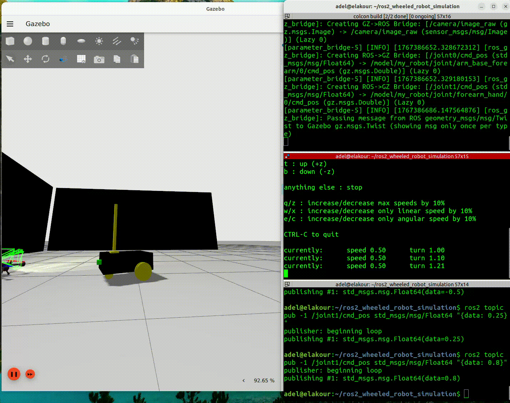

# ROS 2 Wheeled Robot With 2-DOF Arm in Gazebo Sim



This project contains a small mobile manipulation robot built with URDF/Xacro and simulated in Gazebo Sim (`gz-sim`). The robot combines:

- a differential-drive wheeled base
- a fixed forward-facing RGB camera
- a 2-DOF arm mounted on top of the chassis
- ROS 2 to Gazebo bridges for motion, joint state feedback, arm control, and camera data

The repository is organized as a minimal ROS 2 workspace with one package for the robot model and one package for simulation bringup.

## What The Project Does

Launching the simulation will:

- generate the robot model from Xacro
- publish the robot description with `robot_state_publisher`
- start Gazebo Sim with a custom world
- spawn the robot into the world from the `robot_description` topic
- bridge selected Gazebo topics into ROS 2 with `ros_gz_bridge`
- open RViz for TF and model visualization

The current world includes:

- a large ground plane
- two wall obstacles
- one UAV model already placed in the scene

## Workspace Layout

```text
.
├── README.md
├── Project_2.gif
└── src
    ├── my_robot_bringup
    │   ├── config
    │   │   └── gazebo_bridge.yaml
    │   ├── launch
    │   │   └── my_robot_gazebo.launch.xml
    │   ├── worlds
    │   │   └── robo_uav_wall.sdf
    │   ├── CMakeLists.txt
    │   └── package.xml
    └── my_robot_description
        ├── launch
        │   └── display.launch.xml
        ├── urdf
        │   ├── arm.xacro
        │   ├── arm_gazebo.xacro
        │   ├── camera.xacro
        │   ├── common_properties.xacro
        │   ├── mobile_base.xacro
        │   ├── mobile_base_gazebo.xacro
        │   └── my_robot.urdf.xacro
        ├── CMakeLists.txt
        └── package.xml
```

## Packages

### `my_robot_description`

Defines the robot model using modular Xacro files:

- `mobile_base.xacro`: base chassis, two drive wheels, one caster wheel
- `camera.xacro`: forward-facing box camera and Gazebo camera sensor
- `arm.xacro`: arm base plus two revolute joints
- `mobile_base_gazebo.xacro`: differential-drive and joint state Gazebo plugins
- `arm_gazebo.xacro`: joint position controller plugins for the arm
- `common_properties.xacro`: shared materials and inertia macros

### `my_robot_bringup`

Contains the runtime pieces:

- `my_robot_gazebo.launch.xml`: main simulation launch file
- `gazebo_bridge.yaml`: ROS 2 <-> Gazebo topic bridges
- `robo_uav_wall.sdf`: custom Gazebo world

## Robot Overview

### Mobile base

- rectangular chassis: `0.6 x 0.4 x 0.2 m`
- two continuous drive wheels
- one rear/front caster support wheel
- differential drive implemented through Gazebo's `DiffDrive` system

### Arm

- mounted on top of `base_link`
- two revolute joints:
  - `arm_base_forearm`
  - `forearm_hand`
- both joints rotate around the Y axis
- both joints currently have limits from `0` to `1.57 rad`

### Camera

- fixed to the front of the base
- publishes:
  - `/camera/image_raw`
  - `/camera/camera_info`
- configured with:
  - resolution `640x480`
  - update rate `20 Hz`
  - horizontal FOV `1.3962634 rad`

## Topic Interfaces

The bridge configuration exposes the following ROS 2 interfaces.

### Input topics

Use these ROS 2 topics to control the robot:

```bash
/cmd_vel
/joint0/cmd_pos
/joint1/cmd_pos
```

- `/cmd_vel`: drive the base with `geometry_msgs/msg/Twist`
- `/joint0/cmd_pos`: command the `arm_base_forearm` joint with `std_msgs/msg/Float64`
- `/joint1/cmd_pos`: command the `forearm_hand` joint with `std_msgs/msg/Float64`

### Output topics

The simulation publishes:

```bash
/clock
/joint_states
/tf
/camera/camera_info
/camera/image_raw
```

## Prerequisites

You need a ROS 2 environment with Gazebo Sim support installed. At minimum:

- ROS 2 Humble or newer
- `colcon`
- `xacro`
- `robot_state_publisher`
- `rviz2`
- `ros_gz_sim`
- `ros_gz_bridge`

If you install packages through apt on Ubuntu, the exact package names depend on your ROS 2 distribution.

## Build

From the workspace root:

```bash
colcon build --symlink-install
source install/setup.bash
```

## Run

Start the full simulation:

```bash
ros2 launch my_robot_bringup my_robot_gazebo.launch.xml
```

If you only want to inspect the model in RViz with a joint state GUI:

```bash
ros2 launch my_robot_description display.launch.xml
```

## Control Examples

Drive the base forward:

```bash
ros2 topic pub /cmd_vel geometry_msgs/msg/Twist "{linear: {x: 0.5}, angular: {z: 0.0}}" -r 10
```

Rotate the first arm joint:

```bash
ros2 topic pub /joint0/cmd_pos std_msgs/msg/Float64 "{data: 0.8}" --once
```

Rotate the second arm joint:

```bash
ros2 topic pub /joint1/cmd_pos std_msgs/msg/Float64 "{data: 0.5}" --once
```

Inspect the camera stream:

```bash
ros2 topic echo /camera/camera_info
```

## Launch Architecture

The main launch file wires the system together in this order:

1. Load `my_robot.urdf.xacro` into `robot_state_publisher`
2. Launch RViz
3. Start Gazebo Sim with `robo_uav_wall.sdf`
4. Spawn the robot using `ros_gz_sim create -topic robot_description`
5. Start `ros_gz_bridge` using `gazebo_bridge.yaml`

## Important Notes

This repository currently contains a few machine-specific assumptions:

- `my_robot_gazebo.launch.xml` uses a hardcoded RViz config path:
  - `/home/adel/robot_config.rviz`
- `robo_uav_wall.sdf` references Gazebo Fuel assets through hardcoded local file URIs under:
  - `/home/adel/.ignition/fuel/...`

If those resources do not exist on your machine, update those paths before launching.

## Known Cleanup Opportunities

The project works as a good educational simulation workspace, but a few improvements would make it more portable:

- replace hardcoded absolute paths with package-relative assets
- add a checked-in RViz config file inside the repository
- remove duplicate `/camera/image_raw` bridge entries from `gazebo_bridge.yaml`
- fill in package metadata in `package.xml`
- add installation or setup notes for Gazebo Fuel models

## Verification Status

The repository structure and configuration were inspected directly from source files. Runtime verification was not executed in this session because the current environment does not have `xacro` or `colcon` installed.
